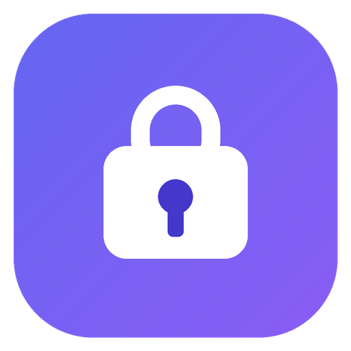
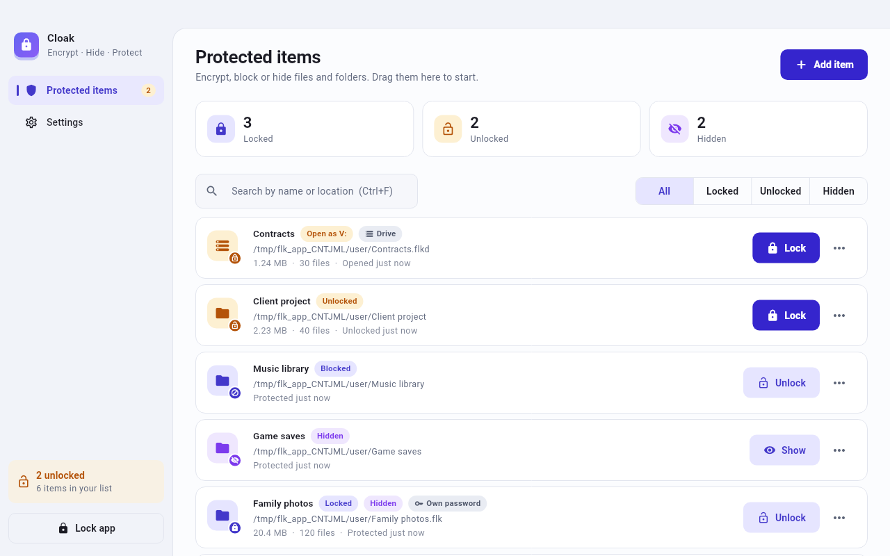
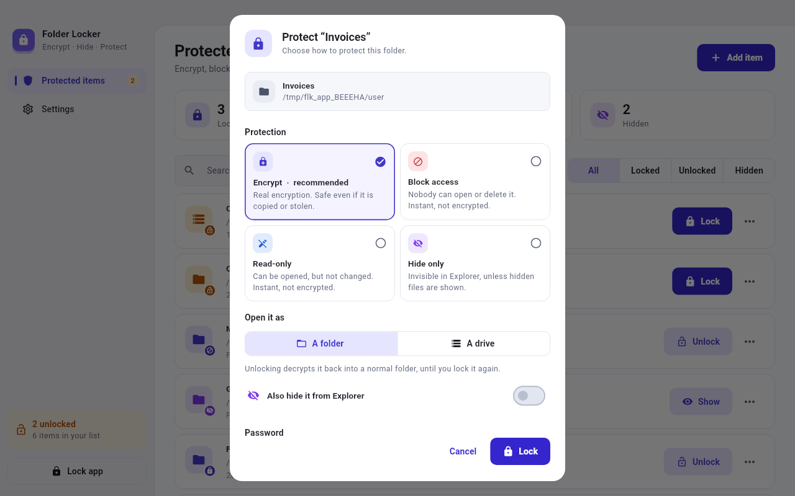
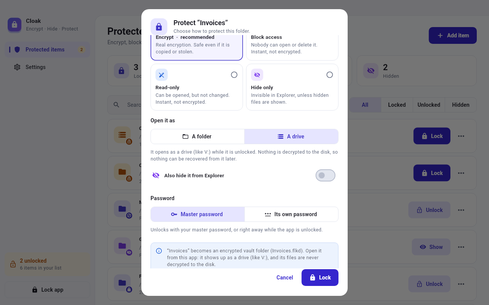
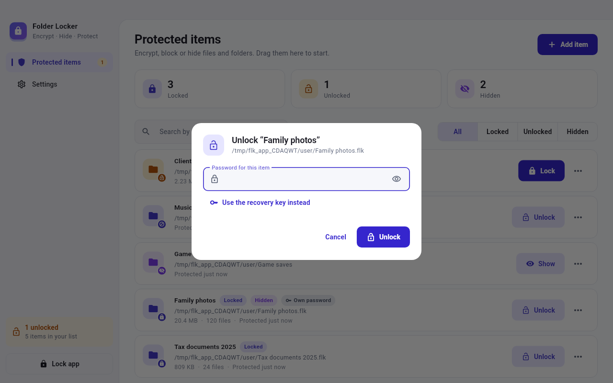
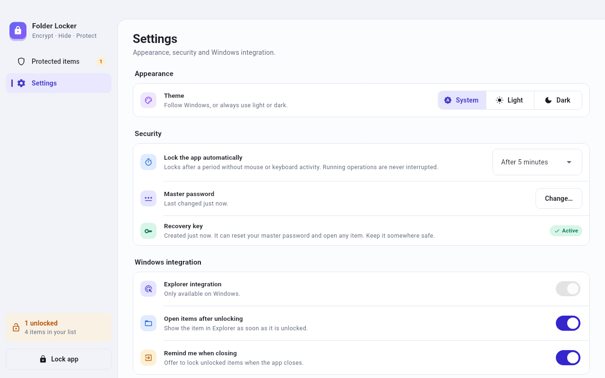
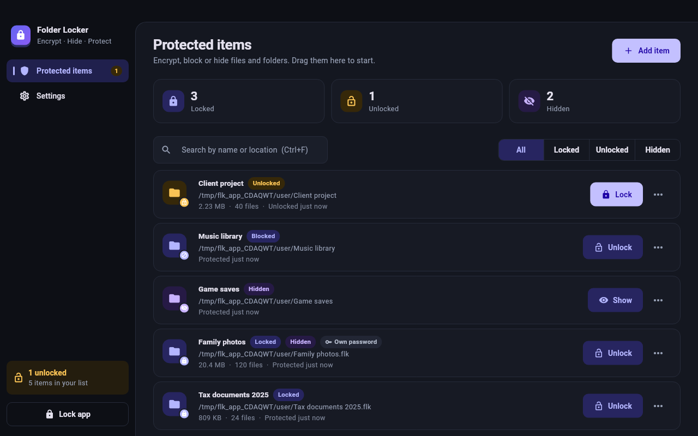
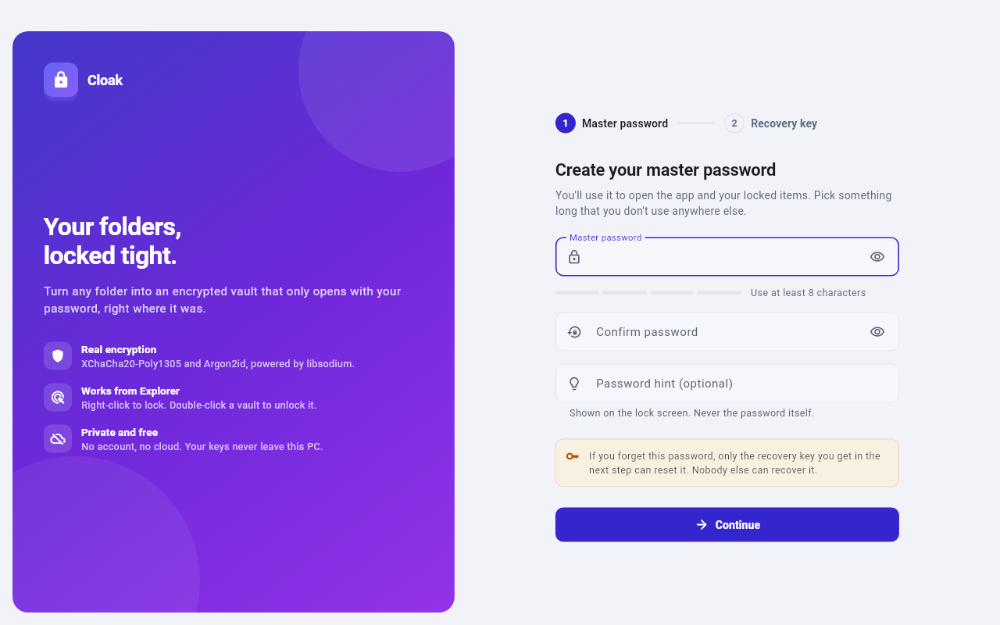
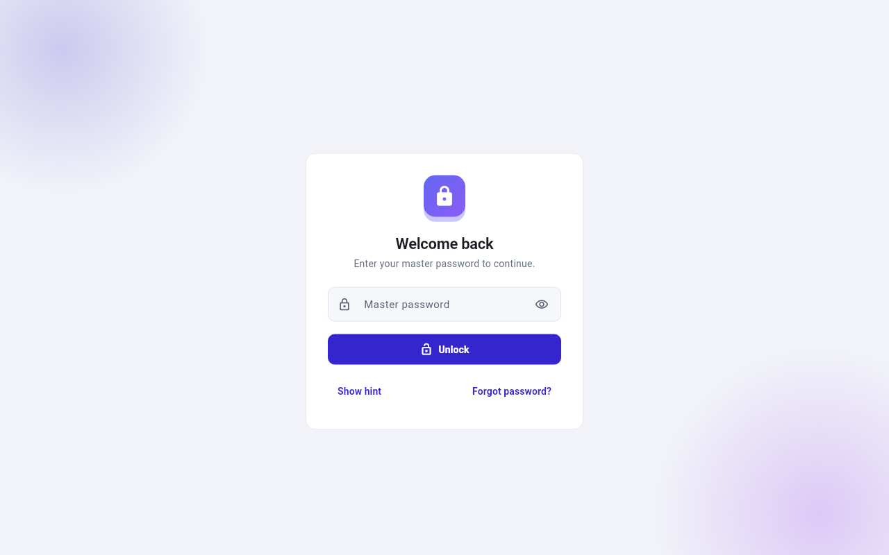

<p align="center">
  
</p>

<h1 align="center">Folder Locker</h1>

<p align="center">
  Lock, encrypt and hide folders on Windows. Free, private, and built with Flutter.
</p>

<p align="center">
  <a href="https://github.com/priyankraychura/desktop_folder_locker/actions/workflows/ci.yml"></a>
</p>

Folder Locker turns a folder or file into an **encrypted vault** (`Name.flk`)
in the same place. The vault shows a lock icon in Explorer. Double-click it,
type your password, and your folder comes back.

A folder can also become an **encrypted drive** (`Name.flkd`). Unlock it and
it opens as a drive such as `V:`. Its files are decrypted in memory only
while programs use them, so nothing unencrypted is ever written to the disk.

It works like Anvi Folder Locker, but it uses real encryption instead of a
kernel driver. Your files stay protected even if someone copies them or takes
the disk out of the PC, and the app can be built and shipped for $0.

| Protected items | Protect dialog |
|---|---|
|  |  |
| **Open as a drive** | **Unlock dialog** |
|  |  |
| **Settings** | **Dark mode** |
|  |  |
| **Setup** | **Lock screen** |
|  |  |

<sub>The test suite renders these screenshots (`test/visual`), so the paths
shown are temporary test folders.</sub>

## Features

- **Encrypt** folders and files into a single `.flk` vault. It uses
  XChaCha20-Poly1305 and Argon2id, from [libsodium](https://libsodium.org).
- **Open as a drive** (new in 1.2): an encrypted folder opens as a drive
  such as `V:`, and nothing unencrypted is written to the disk. After the
  first lock, opening and locking it are instant at any size, and locking
  needs no password. It uses the free
  [Dokany](https://github.com/dokan-dev/dokany) driver. See
  [docs/DRIVE_VAULT.md](docs/DRIVE_VAULT.md).
- **Block access** or make items **Read-only**, instantly, even for huge
  folders. The item stays in place, and a Windows permission rule stops
  anyone from opening it (or from changing it).
- **Hide** items from Explorer, alone or together with any other method.
- **Master password** for everything, or **a password of its own** for any
  item.
- **Recovery key**, shown once during setup. It resets the master password
  and opens every vault.
- **Explorer integration**:
  - vaults show a lock icon;
  - **double-click opens the password dialog**;
  - folders and files get **Lock with Folder Locker** in the right-click
    menu.
- **Notification-area icon**: the app keeps running when you close the
  window. The icon shows when items are unlocked, and its menu locks
  everything in one click.
- **Reminders and automatic re-locking** for items you leave unlocked. You
  can also lock them automatically whenever the app locks.
- **New recovery key** at any time. Every vault switches to it safely.
- **Crash-safe**:
  - every new vault is decrypted and checked *before* the original is
    deleted;
  - a journal finishes or rolls back any operation that a crash or power
    loss interrupted.
- **Modern UI**:
  - light and dark themes, custom title bar and drag & drop;
  - search and filters, progress with cancel, toasts and auto-lock;
  - keyboard shortcuts.
- **Private**: no account, no cloud and no telemetry. Using the app needs
  no administrator rights; only installing it for all users (and Dokany)
  asks once.

## How it works

1. On first start you create a master password and save your recovery key.
2. Drag a folder into the app, or right-click it in Explorer and choose
   **Lock with Folder Locker**. Then choose how to protect it:
   - **Encrypt** (recommended),
   - **Block access**,
   - **Read-only**, or
   - **Hide only**.

   You can also hide it with any of these. With **Encrypt**, a folder can
   open as **a folder** or as **a drive**.
3. With **Encrypt**, the folder becomes `Name.flk`, with a lock icon, in the
   same place. The original files are deleted only after the vault has been
   verified. As a drive, it becomes the vault folder `Name.flkd` instead.
   With **Block access** or **Read-only**, it stays where it is and Windows
   refuses to open it (or to change it).
4. Double-click `Name.flk` to get the password dialog. The folder is
   restored and opened. A drive vault opens as a drive (for example `V:`)
   instead: click **Open** in the app, or double-click `vault.flk` inside
   `Name.flkd`.
5. Click **Lock** in the app, or **Lock all items** in the menu of its icon
   next to the clock, to lock it again. The app can remind you about
   unlocked items, lock them again by itself, and offer to lock them when
   you quit.

## Install

The app is not published yet. To try it:

1. Open the latest successful
   [CI run](https://github.com/priyankraychura/desktop_folder_locker/actions/workflows/ci.yml).
2. Download the **folder-locker-setup** artifact.
3. Run `FolderLocker-Setup-<version>.exe`. It installs for all users, with
   one administrator prompt at the start, or, if you choose **Install for me
   only**, for you without one.

The installer is not code-signed yet (planned in Phase 4), so Windows
SmartScreen warns about it. Click **More info → Run anyway**.

Opening encrypted folders as drives needs
[Dokany](https://github.com/dokan-dev/dokany), a free driver. If it's
missing, the installer installs it too (the task is ticked by default), with
the same administrator prompt. You can also install it later with **Install
Dokany** in **Settings → Encrypted drives**, which also shows whether it's
ready.

## Build from source

Requirements:

- Windows 10 or 11 (x64)
- [Flutter](https://docs.flutter.dev/get-started/install/windows/desktop)
  3.47 or newer (stable channel)
- Visual Studio 2022 or 2026 with the **Desktop development with C++**
  workload. Flutter needs it, and the `sodium` package uses it to compile
  libsodium from source automatically on the first build.
- [Rust](https://rustup.rs) (stable, the default MSVC toolchain) for the
  drive helper in `native/`.

```powershell
cd native; cargo build --release; cd ..   # the drive helper
flutter pub get
flutter run -d windows            # run in debug mode
flutter test                      # run the tests
flutter build windows --release   # build\windows\x64\runner\Release
# Dokany's installer, checked against its known SHA-256, next to the app:
pwsh installer\get-dokany.ps1 -Destination build\windows\x64\runner\Release\dokany
```

`flutter build windows` copies the release helper
(`native\target\release\folder_locker_drive.exe`) next to the app, if it
has been built. To try a debug build of the helper instead, set
`FOLDER_LOCKER_DRIVE` to its path. `cargo test` in `native/` runs the
helper's tests; the drive test needs Dokany (see
[docs/DRIVE_VAULT.md](docs/DRIVE_VAULT.md)).

To build the installer, install [Inno Setup 6](https://jrsoftware.org/isinfo.php),
then:

```powershell
# The app needs the Visual C++ runtime next to the exe.
copy C:\Windows\System32\msvcp140.dll     build\windows\x64\runner\Release
copy C:\Windows\System32\vcruntime140.dll   build\windows\x64\runner\Release
copy C:\Windows\System32\vcruntime140_1.dll build\windows\x64\runner\Release
& "${env:ProgramFiles(x86)}\Inno Setup 6\ISCC.exe" /DAppVersion=1.2.0 installer\folder_locker.iss
```

The installer is written to `build\installer`. CI runs all these steps on
every push.

You can develop the engine and the UI on Linux or macOS too: `flutter test`
and `cargo test` work there, and the Windows-only parts (registry, file
attributes, drives) do nothing. Build the helper with `cargo build` in
`native/` first, so the app's tests can talk to it. To regenerate the
screenshots:

```sh
SCREENSHOTS_DIR=docs/screenshots SCREENSHOTS_SCALE=1 flutter test test/visual
```

## Keyboard shortcuts

| Keys | Action |
|---|---|
| `Ctrl` + `O` | Protect a folder |
| `Ctrl` + `Shift` + `O` | Protect a file |
| `Ctrl` + `F` | Search |
| `Ctrl` + `L` | Lock the app |
| `Ctrl` + `1` / `Ctrl` + `2` | Protected items / Settings |

## Security notes and limitations

**What it protects:** anything that is encrypted. A vault can't be read or
changed without your password or recovery key, even if someone copies it or
removes the disk. Any change to a vault is detected.

**Please know:**

- **There is no back door.** If you forget your password *and* lose your
  recovery key, the data can't be recovered by anyone.
- **Hide alone is not security.** Anyone who turns on "show hidden and
  system files" can see a hidden item. Use Encrypt for anything private.
- **Block access and Read-only are not encryption either.** They stop
  other people and accidents on this PC. But the folder's owner (in
  Properties → Security) or an administrator can remove the rule, and
  another operating system ignores it.
- **While an item is unlocked**, its files are normal files on disk. Lock it
  again when you're done. After locking, the deleted originals can sometimes
  be recovered with forensic tools (less likely on SSDs). **Open as a
  drive** avoids this: a drive vault is never decrypted to the disk.
- **Drive vaults** need Dokany. While a drive is open, every program running
  as you can read it, and deleting on it is permanent (no Recycle Bin).
  Without the password, the number of files, their sizes and dates can be
  seen, but not their names or contents. Details are in
  [docs/DRIVE_VAULT.md](docs/DRIVE_VAULT.md).
- The vault keeps file contents, names, dates and the read-only, hidden and
  system attributes. It doesn't keep NTFS permissions or alternate data
  streams. Folders with symbolic links or junctions are refused.
- The design uses well-known primitives from libsodium, but it has **not had
  an independent security audit**.

See [docs/ARCHITECTURE.md](docs/ARCHITECTURE.md) for the vault format and
the security model, and [docs/DRIVE_VAULT.md](docs/DRIVE_VAULT.md) for drive
vaults.

## Project structure

```text
lib/
  main.dart              entry point → app/bootstrap.dart
  app/                   startup, root widget, app-wide listeners
  core/                  shared building blocks
    theme/               design tokens, palette, Material 3 theme
    widgets/             reusable UI (buttons, cards, dialogs, fields…)
    storage/             app folders, atomic JSON files
    di/                  app-wide Riverpod providers
  engine/                vault engine: pure Dart + libsodium, no Flutter
    crypto/              libsodium wrapper, Argon2id settings, recovery key
    format/              .flk header, key slots, chunked encryption, archive
    vault/               write / read vaults, drive vault headers
    operations/          lock, unlock, re-key, crash journal
    drive/               the drive helper's client, drive lock and decrypt
  platform/              Windows: registry, FFI, single instance, shell
  features/
    auth/                master password, lock screen, auto-lock
    items/               protected items: list, protect/unlock, dialogs
    settings/            preferences
    setup/               first-run onboarding
    shell/               home window, sidebar, launch arguments
test/                    engine, feature, widget and screenshot tests
native/                  the drive helper, in Rust (Cargo workspace)
  vault2/                drive vault format: keys, names, contents, tree
  drive/                 folder_locker_drive.exe: protocol, Dokany drive
  vendor/dokan/          Dokany bindings for Rust, with a fix
installer/               Inno Setup script
tool/                    icon generator
docs/                    roadmap, architecture, screenshots
```

Each feature has the same folders: `domain` (models), `data` (storage),
`application` (logic, Riverpod controllers) and `presentation` (screens and
widgets).

## Roadmap

| Phase | What | Status |
|---|---|---|
| 1 | Core app: encrypt, hide, Explorer basics, installer | Code complete, needs testing on a real Windows PC |
| 1.1 | Block access, Read-only, tray icon, reminders, auto re-lock, new recovery key | Code complete, tray and Explorer behaviour need a real PC |
| 2 | Open vaults as a virtual drive (Dokany), no plain files on disk | Code complete, the drive is tested on Windows in CI, the app needs a real PC |
| 3 | Explorer plug-in: locked folders stay real folders | Planned |
| 4 | Publishing: GitHub Releases, Microsoft Store, free code signing | Planned |

Details are in [docs/PLAN.md](docs/PLAN.md).
